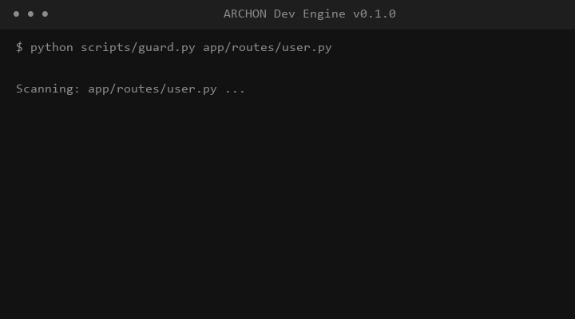

# ARCHON Dev Engine

> Stop AI from writing fragile backend systems.

**ARCHON Dev Engine** is a Cursor Plugin that enforces production-grade engineering discipline. It ensures your AI agents build systems that are async-first, deterministic, and production-ready.

## The Core Discipline
- **Async-First**: Blocks blocking I/O (requests, types) in critical paths.
- **Structured Output**: Mandates JSON schemas for AI responses.
- **Deterministic Config**: Prevents hardcoded secrets and silent defaults.
- **Architecture Scoring**: Gamifies engineering quality with your own "ARCHON Score".

## Quick Start (72 Seconds)

1. **Install Plugin**:
   - Open Cursor Settings -> Plugins -> Development.
   - Load this folder.
2. **Set the Doctrine**:
   - Cursor's AI will now automatically follow the `.mdc` rules in this repo.
3. **Enable the Guard**:
   - Run `python scripts/install-guard.py` to enable the git pre-commit veto.
4. **Get Your Score**:
   - Run `python scripts/score.py` to check your project's compliance.

## The ARCHON Doctrine
ARCHON is built for AI-first teams who need to move fast without the stability of their backend collapsing. It doesn't just suggest—it enforces.

## Features v0.1.0
- **ARCHON Architect**: Specialized system designer agent for production-grade backends.
- **Async Veto**: Real-time rejection of fragile code patterns.
- **Fail-Closed Security**: Git-level doctrine enforcement that stops bad code at the commit.

---
Built by **A-ONE GLOBAL RESOURCING LTD**.
[MIT License](LICENSE)
